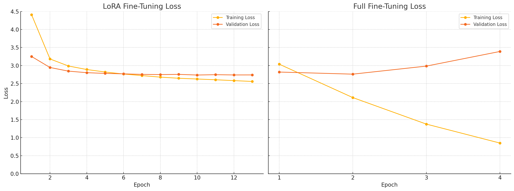

## Slogan Generator

Based on dataset and method in the following paper:

> Jin, Yiping, Akshay Bhatia, Dittaya Wanvarie, and Phu TV Le. "Toward Improving Coherence and Diversity of Slogan Generation". Accepted to Natural Language Engineering. Cambridge University Press.

### Five Models Included

1. `scratch_barttok`: Using pretrained BART tokenizer, and build a decoder-only transformer model from scratch.
2. `scratch_bpe`: Using BPE customized tokenzier, and build a decoder-only model from scratch.
3. `scratch_encoder_decoder`: Using pretrained BART tokenizer, and build a encoder-decoder transformer model from scratch.
4. `finetune_bart_lora`: Using pretrained BART tokenizer, and use LoRA to finetune the DistilBART model (https://huggingface.co/sshleifer/distilbart-cnn-6-6)
5. `finetune_bart_all`: Using pretrained BART tokenizer, and directly finetune all the parameters of DistilBART

### Metrics for Evaluation

Refering to the original paper, the models are using ROUGE for evaluating the quality of the slogan generated.

### Loss Plot for Fine-tuning

